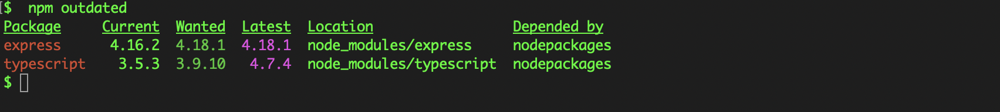

## The Problem

How can you update each dependency in a `package.json` file?

You can manually update each dependency's version number in `package.json` file. But is there a way to update them without making changes to the `package.json` file manually?

## The Solution

Before you update any dependency to a major updated version, make sure to check for backward compatibility.

You can find out all outdated dependencies by running the following command:

```bash
npm outdated
```

All dependencies in your current project will be listed with their current, wanted, and latest versions:



The **wanted** version is the version that is safe to update to without checking for breaking changes. It is calculated depending on how your dependency versions are declared in the `package.json` file, but it usually does not include major changes.

You can update all dependencies to the **wanted** version using the following command:

```bash
npm update
```

Or you can update individual dependencies by specifying its name, like so:

```bash
npm update express
```

If you want to update your dependencies to the **latest** version, the safest option is to update manually after checking the changelog of each dependency.

But if you want a quicker way to update all dependencies to the **latest** version at once, you can use [npm-check-updates](https://www.npmjs.com/package/npm-check-updates). According to the documentation:

> `npm-check-updates` upgrades your `package.json` dependencies to the _latest_ versions, ignoring specified versions.

The `npm-check-updates` module will update the `package.json` file to the latest versions for all dependencies. You can do so with the following command:

```bash
npx npm-check-updates -u
```

If you are working in a fresh project (for example, if you have copied the `package.json` file from another project and haven't installed any dependencies yet), you can just run:

```bash
npm install
```

If you have the dependencies installed already, you can delete the `node_modules` folder from your project and then run `npm install` and all dependencies will be installed to the **latest** version.
