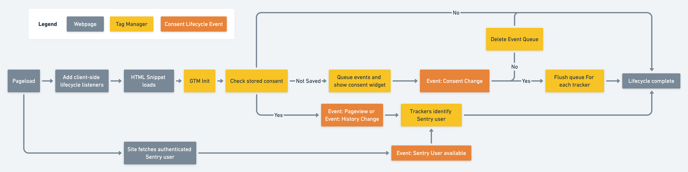

# Privacy, Consent, and Tracking for Static Sites

Data privacy is important and we adopt a privacy-first approach to tracking. For information about our policy, see [the Cookie Policy](https://www.notion.so/sentry/Cookie-Policy-fa4a42b4947d4ee98ab9b55de73148c0) in Notion.

For static sites, we manage our trackers and consent to track through Google Tag Manager. This project serves only as documentation, as we cannot store the source code here.

## Getting Started

To add Google Tag Manager, which will load our trackers as well as the consent widget, you need to add the following to your site, as high up in the `<head>` as you can manage.

```html
<script type="text/javascript">
  (function(w, l) {
    w[l] = w[l] || [];
    w[l].push({ 'gtm.start': new Date().getTime(), event: 'gtm.js' });
  })(window, 'dataLayer');
</script>
<script
  src="https://www.googletagmanager.com/gtm.js?id=GTM-N72TJRH"
  async
></script>
```

That’s it. When the page loads, Google Tag Manager will initialize and handle requesting consent to track.

To use our Google Tag Manager configuration with Gatsby, please use our [Gatsby plugin](../shared/gatsby/plugins/gatsby/gatsby-plugin-privacy-and-consent).

## Developer Guide: Client Side Options

If you would like to make modifications to our trackers and the consent flow, you need to do so in Google Tag Manager. The following guide documents client side APIs and the logic that the Tag Manager configuration is built upon.

### Local development

By default, Google Tag Manager is configured to not activate for localhost or `0.0.0.0` urls. To allow it to load in local development, in the initial snippet, add this line:

```javascript
// Don’t commit this. It just makes things work in local development
w[l].push({ disableTagsInLocalDevelopment: 'false' });
```

This is only necessary if you need to modify something about the embed code itself. In general, most of your development will happen within the Google Tag Manager site [There's a section about that](developer-guide-google-tag-manager), and previewing of your changes can be done on the production site using an instance of GTM that is unique to only you.


### Lifecycle events



If you have specific concerns that require the privacy lifecycle but do not belong in the universal Google Tag Manager config, you can listen on the `window` for lifecycle events. Each event includes `details` which includes the consent status and current Sentry user, if it is available.

Ideally, add these listeners before the Google Tag Manager snippets. The pageview event may otherwise fire before your listener is ready.

```javascript
window.addEventListener('gtmPageview', function(event){
  const {doNotTrack, sentryUser} = event.detail
  if(doNotTrack) return

  ... do creepy marketing stuff here.
})
```

The following events are supported:

- `gtmPageview` — Fired when a visitor initially visits to the Gatsby app. Analogous to Gatsby’s `onClientEntry` event. In the scope of a Gatsby application, this is fired once before the app is loaded, and is not fired again as new pages are loaded and navigated (when configured to do so). Generally both this and `gtmHistoryChange` should be used together.

- `gtmHistoryChange` — Fired whenever pushstate is used. Analogous to Gatsy’s `onRouteUpdate` event. In the scope of a Gatsby application, this is fired as new pages are loaded, but is not fired on the initial page. Generally both this and `gtmPageView` should be used together.

- `gtmConsentReady` — Fired when the Privacy and Consent widget appears and is ready for interaction.

- `gtmConsentChange` — Fired when the user interacts with the Privacy and Consent widget. The `details` property of the event contains a `doNotTrack` boolean reflecting the new state the user has requested.

- `gtmSentryUserData` — Fired when the current authenticate user has been fetched. The `details` property of the event contains a `sentryUser` object containing the user id and ids of the organizations to which they belong.

### Manually Indicating Consent

If you need to manually change tracking consent status external to the tracking widget, set the stored consent value, then send Google Tag Manager a `consentChange` event.

```javascript
try {
  // Save the new value. Note the boolean is stored as a String.
  localStorage.setItem('trackingConsent', 'true');

  // Notify Google Tag Manager of the change.
  window.dataLayer.push({ event: 'gtmConsentChange' });
} catch (error) {
  // Noop. Either localStorage does not exist or isn't permitted.
  // We treat this scenario as though tracking is denied so we don't
  // pester the visitor on each new page.
}
```

If you need to prompt the user for consent again, remove the save value and send a new `consentChange` event.

```javascript
try {
  // Save the new value. Note the boolean is stored as a String.
  localStorage.removeItem('trackingConsent', 'true');

  // Notify Google Tag Manager of the change.
  window.dataLayer.push({ event: 'gtmConsentChange' });
} catch (error) {
  // Noop. Either localStorage does not exist or isn't permitted.
  // We treat this scenario as though tracking is denied so we don't
  // pester the visitor on each new page.
}
```

### Manually Recording Clicks

To sent a synthetic click event to Google Tag Manager, push a `gtmClick` event to the dataLayer with a value for `clickText`.

```
const handleOnClick = () => {
  window.dataLayer.push({
    event: 'gtmClick',
    clickText: 'Clicked Important Marketing Button',
    extraData: {
      clickVelocity: 'Hella hard'
    }
  });
};

```

## Developer Guide: Google Tag Manager

Since nearly all of the Google Tag Manager logic lives in their GUI, this documentation serves as an explanation of how things work.

### Development workflow

Sign into [Google Tag Manager](https://tagmanager.google.com/) to get started. You will need to be granted the appropriate permissions to contribute. Once in, open up the "Static Websites" account and then the Default Workspace.

Sorry, no git here. Instead, GTM uses "workspaces" which you can think of like branches. There are a limited number of them, so keep them tidy. While they aren't necessary, using workspaces means that you can work without blocking other people, as any changes to the main workspace will get published all at once. By using a development workspace, you can keep your changes separate and only apply then when you're ready.

To create a new Workspace, look for "Current Workspace" in the sidebar, click the selected one, then click the + button in the menu that opens up. This will create a new workspace you can start mucking around in.

Make changes as you see fit. Once you are ready to start testing things, click the Preview button. This will open up a new window to a page of your choosing (prod is fine for this if you aren't modifying the local embed code) with a preview version of GTM that loads only for you. You'll also see in the original window a sidebar that shows a timeline of Triggers and the state of all the various tags during that event. You can click through the events to see what changes over time and determine whether your changes are working as expected.

Once you're done, go back to Google Tag Manager and click the "Submit" button. This will be similar to a commit. You add a description and then publish. Things go live in a few seconds and start appearing on any page you've got Tag Manager installed on.

The publish button is green and in the top right of the page. If you don't see it, you need someone to adjust your permissions _for the specific container_ to allow publishing. It's possible to be an administrator that doesn't have publishing rights, so look out for that.

### On GTM and how we use it.

Google Tag Manager is a code snippet that loads other code snippets into your website. Sounds safe, right?

Think of Tags like actions that can be taken. These can be literal `<script>` tags added to the page. They can also be some of the built-in things that will capture the value of a cookie or the current url for later use. Triggers are events, conditions which will make other things happen. Variables are just that, variables, but in our case, we occasionally use them to hold helper functions that allow for reusing logic.

Our triggers fall into two types, which work together. Triggers prefixed with `Event` are instigators. Tags with these triggers will be added to the page when the Trigger is fired. Triggers prefixed with `Block` are exceptions. Tags will not execute on their `Event` trigger if their `Block` trigger condition is not met.

For example, `Event — Pageview` is typically paired with `Block — Consent — Do Not Track`. This means that when a page view happens (event), the associated tag won't be added to the page if consent has not been given. Conversely, this means that the tag will only be executed if consent has been granted. Much of this reasoning came from [this blog post](https://www.analyticsmania.com/post/gdpr-cookie-consent-notification-with-google-tag-manager/) and some of his related work around GDPR consent.

Our static sites are single pages apps, so they don't have traditional pageviews. Instead, we usually use a combo of triggers:

- `Event — Pageview` — Used instead of the built in pageview trigger, because it is executed after we've checked for tracking consent. The built in pageview triggers before consent is requested.
- `Event — History Change` — Fired when Gatsby changes pages. Happens for each page change after the initial page load. Equivalent to a Pageview.
- `Event — Consent Change` — Fired when someone changes their consent status. Effectively a pageview since the pageview wouldn't have been captured before this point.

Each service we use typically has multiple tags. There is usally a `Setup` tag which adds necessary dependencies the page for other tags related to the service. This is set to only be added once per page (so that it doesn't get added again when Gatsby navigates). Then there is usually a `Pageview` tag and possibly a few others.

More info on these events and when they happen can be found in the [Lifecycle events section](#lifecycle-events).

### Pageview Tracker Sequence

When the page first loads, Google Tag Manager is initizlied with minimal configuration. Everything thereafter is handled withing Tag Manager itself.

The first trigger that occurs is an All Pages trigger which configures the privacy defaults and checks if stored consent status is saved, using it instead if it exists. It then triggers a synthetic pageview event.

All tags that need to measure pageviews listen for this event instead of the built-in pageview event to ensure that privacy is properly established before they act.

### Tag Cleanup

Google tags work by inserting `<script>` tags into the DOM. To avoid DOM polution, our tags remove themselves once they've done their action.

To disable this for the purpose of debugging, set the `Clean Up Script Tags When Action Is Complete` variable to `false`

## Discrepencies

The document above is optimistic, and does not reflect the actual reality of the configuration, pending some internal decisions. Once the decisions are made, this section will be removed and the code will be updated. Presently, here are is how we violate our cookie policy:

### Google Tag Manager

Tag Manager is currently not configured to use `ads_data_redaction='true'`. According to the [Google documentation](https://support.google.com/analytics/answer/9976101?hl=en), this means:

- No new cookies pertaining to advertising may be written.
- No existing first-party advertising cookies may be read.
- Requests are sent through a different domain to avoid previously set third-party cookies from being sent in request headers.
- Google Analytics will not read or write Google Ads cookies, and Google signals features will not accumulate data for this traffic.
- Full page URL is collected, may include ad-click information in URL parameters (e.g., GCLID / DCLID). Ad-click information will only be used to approximate accurate traffic measurement.
- IP addresses are used to derive IP country, but are never logged by our Google Ads and Floodlight systems and are immediately deleted upon collection. Note: Google Analytics collects IP addresses as part of normal internet communications. Learn more about IP anonymization in Google Analytics.

### Amplitude

Amplitude presently caches pre-consent events, and if consent is granted, sends them at that time. It is currently being debated whether this is considered a violation of our cookie policy. Whether this is valid or not hinges upon whether pre-consent events may be stored but not tracked.
