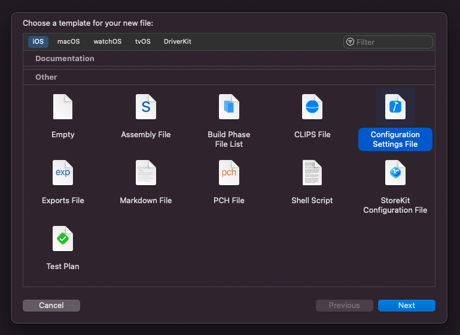
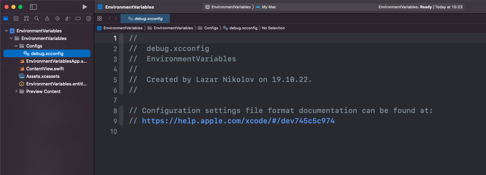
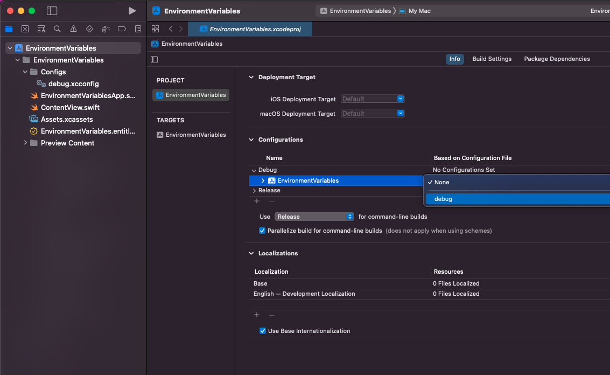
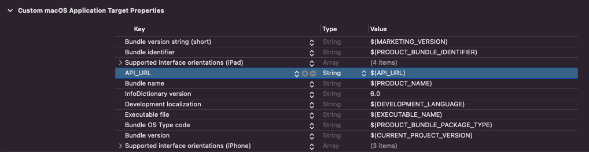

## The problem

In most of the cases we&apos;ll need to store some sort of a value or secret within our app. Whether that&apos;s an API key, or our backend&apos;s URL. We might even want to provide different values for certain properties in Development mode and Production mode.

## The Solution

Environment Variables are key-value properties that are defined in a certain place, and can be accessed from within the app. We usually use environment variables to store the API URL for both development and production, we also store our API keys that authorize our app with the backend. One of the super powers of the environment variables is the fact that they are stored in a separate file (that can be git-ignored!). That&apos;s why it&apos;s recommended to store your secrets as environment variables, so you don&apos;t leak them on GitHub.

To setup support for environment variables, we need to create a new `Configuration Settings File` in our project. So let&apos;s create a new group called `Configs` in our project and a new `debug.xcconfig` configuration file inside of it.





Let&apos;s add a value:

```markdown
API_URL=debug.sentry.io/api
```

Now we need to set this file as the Debug configuration file for our project. Head to the Project Settings, and in the Configurations section, expand the Debug item and select the “debug” option for your project:



To make our `API_URL` variable available in our app, we also need to register it in our `info.plist` file. To do that:

1. Click on the target and go to the Info tab
2. Right click on any row in the “Custom Target Properties” and pick `Add Row`
3. Set the key to `API_URL` and the value to `$(API_URL)`



This step injects our environment variables into the “Info Dictionary”, and now we can access them in our code:

```swift
if let apiUrl = Bundle.main.infoDictionary?["API_URL"] as? String {
    // we have our API_URL value!
}
```
