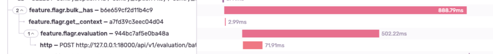
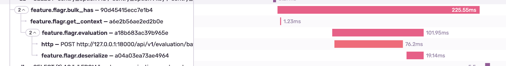

## The Problem

Using libraries like [Flagr](https://openflagr.github.io/flagr) to help maintain feature flags 
had a negative performance impact; it was taking 900ms to only check 50 flags.

Using Sentry performance monitoring, we discovered the majority of the time was 
spent deserializing the Flagr response.  

## The Solution

Digging into the client, we noticed that deserialization was turning the entire 
JSON blob (i.e. the flag results) into a Python object. While deserializing JSON 
is convenient from a development perspective, because we were only using a few 
JSON fields, the cost just wasn’t worth it. 

After removing caching and patching our own deserializer with a simple 
json.loads(response.data) we saw a huge improvement in speed — so much so that 
other areas began to look slow by comparison:

### Further Reading

- [Using Sentry Performance To Make Sentry Performant](https://blog.sentry.io/2021/03/25/using-sentry-performance-to-make-sentry-performant)
- [Fetch Feature Flags Faster - Snack of the Week](https://sentry.io/resources/fetch-feature-flags-faster-sotw2/)
- [Feature Flag Docs](https://develop.sentry.dev/feature-flags/)
