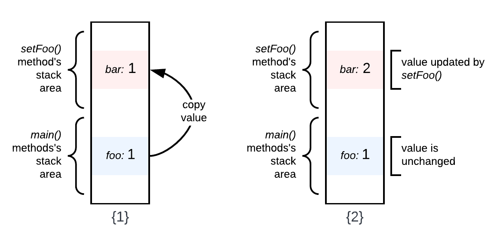
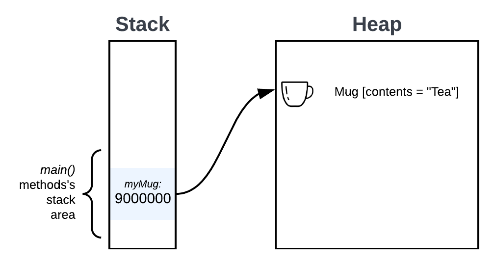
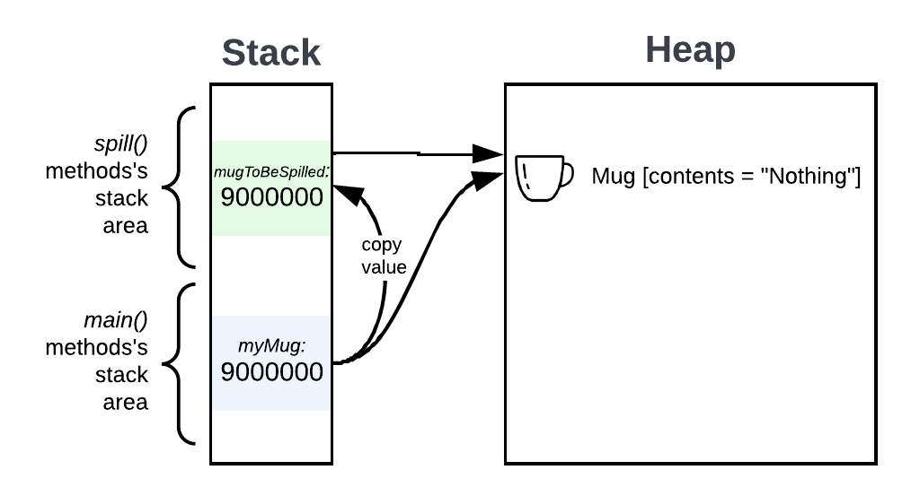

## The Problem
A simple Google search of this question will return a straightforward answer that *Java is always pass-by-value*. The reason this question is confusing is because Java achieves its functionality using special variable types known as **object references**.

## The Solution

Before we continue, let's briefly define the terms **pass-by-reference** and **pass-by-value**:

- Pass-by-reference: When a method is called, the method arguments reference the same variable in memory as the caller.
- Pass-by-value: When a method is called, the caller passes a copy of the argument variables to the method resulting in two values in memory.

Let's look at these concepts more closely with the code snippet below:

```java
public class Mug {

    private String contents;

    public Mug(String contents) {
        this.contents = contents;
    }

    public void setContents(String contents) {
        this.contents = contents;
    }

    public String getContents(){
        return contents;
    }
}

public class Run {

    public static void spill(Mug myMug) {
        myMug.setContents("nothing");
    }

    public static void main(String args[]) {
        Mug myMug = new Mug("tea"); // myMug contains "tea"
        System.out.println(myMug.getContents());

        spill(myMug);  // myMug now contains "nothing"
        System.out.println(myMug.getContents());
    }
}
 ```

In example above, the contents of the `Mug` object are manipulated in a way that is functionally very similar to a native pass-by-reference system. However, there is a key difference that is explained by the mechanism of storing non-primitive variable types in Java.

### Primitives

Primitive types in Java, such as  `char`, `int`, and `boolean`, are passed-by-value in the purest sense of the term.

Consider the code snippet below:

```java
public class Run {

    public static void main(String args[]){
        int foo = 13;
        System.out.println(foo); // this will print "1"

        setFoo(foo);
        System.out.println(foo); // this will still print "1"
    }

    public static void setFoo(int bar){
        bar = 2;
    }
}
```

When the primitive `int` type `foo` is passed, it results in two separate `int` variables on the stack, `foo` and `bar`, like this:



1. Calling `setFoo()` will create a copy of `foo`'s value inside the variable `bar` and place this on the stack.

2. Then, `setFoo()` updates `bestNum`'s value to `2` **without** modifying `foo`'s value.

### Non-Primitives

Non-primitive types in Java – that is, objects – are accessed by object references. An object reference is a unique identifier that tells the compiler where to find the referenced object in heap memory. This reference is stored as a *value* on the stack, to which a variable name is assigned. For every instance of an object that is created, a new reference *value* is stored on the stack and a new object is created in the heap.

To explain this, let's return to our Mug example.

```java
(1) public class Mug {
(2) 
(3)     private String contents;
(4) 
(5)     public Mug(String contents) {
(6)         this.contents = contents;
(7)     }
(8) 
(9)     public void setContents(String contents) {
(10)         this.contents = contents;
(11)     }
(12) 
(13)     public String getContents() {
(14)         return contents;
(15)     }
(16) }
(17) 
(18) public class Run {
(19) 
(20)     public static void spill(Mug mugToBeSpilled) {
(21)         mugToBeSpilled.setContents("Nothing");
(22)     }
(23) 
(24)     public static void main(String args[]) {
(25)         Mug myMug = new Mug("Tea"); // myMug contains "Tea".
(26)         System.out.println(myMug.getContents());
(27) 
(28)         spill(myMug);  // myMug now contains "Nothing".
(29)         System.out.println(myMug.getContents());
(30) 
(31)     }
(32) }
```

The following diagrams show the behavior of the object in memory during the various manipulations in the code above. This should help illustrate the differences in how Java passes object references by value and a native pass-by-reference system.



First, we create an instance of the object `Mug` called `myMug`, and set the attribute `contents` to `"Tea"`.  This object is created on the heap and the variable `myMug` is given a reference *value* on the stack. This object reference on the stack points to the object on the heap.



When the `spill()` method is called, the parameter `mugToBeSpilled` will get a copy of the object reference variable `myMug` passed-by-value. Then the `contents` attribute of both Mug objects change to `"Nothing"`. Functionally, this is similar to passing `myMug` by reference. However, the key difference is that we have two copies of the reference type value on the stack.

### Summary

Modern programming languages, such as Java, rarely use a true pass-by-reference system. However, with the use of reference type variables, the end result for the developer is very much the same. The main difference is that a few more instances of reference type variables are created on the stack.

### Further Reading

More information on the topic:
- [TechGenix: Java Parameter Passing: Pass-by-Reference or Pass-by-Value?](https://techgenix.com/java-pass-by-reference-or-pass-by-value/)

Further reading about heap space and stack memory in Java:

- [Baeldung: Stack Memory and Heap Space in Java](https://www.baeldung.com/java-stack-heap)
